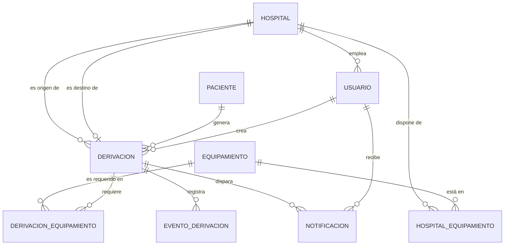

# CareRoute

> Plataforma de coordinación inter-hospitalaria y triaje de traslados críticos.

**Materia:** Metodologías y Desarrollos Web — UAI Rosario
**URL de producción:** https://care-route-beta.vercel.app/
---

## 1. Descripción

La derivación de pacientes críticos entre centros de salud y hospitales de cabecera se resuelve
hoy con llamadas telefónicas no centralizadas. Eso produce pérdida de tiempo vital para
localizar camas de terapia (UTI/UCO), falta de visibilidad sobre el equipamiento especializado
disponible y ausencia de trazabilidad del paciente durante el traslado.

**CareRoute** centraliza ese proceso en una sola herramienta web:

- Visibilidad en tiempo real de camas y recursos disponibles por hospital.
- Asignación asistida por un **triaje inteligente** (IA) que sugiere nivel de urgencia y un
  ranking de hospitales candidatos.
- Trazabilidad de la derivación durante todo el traslado.

> **Importante:** la IA es un apoyo a la decisión, no un diagnóstico médico. Toda sugerencia
> debe ser revisada y confirmada por un profesional. El sistema nunca ejecuta una derivación
> de forma automática.

## 2. Equipo y roles

### 2.1 Equipo de desarrollo

| Integrante | GitHub |
|---|---|
| Mateo Dip | [@MateoDip](https://github.com/MateoDip) |
| Mateo Duran | [@mduranclem](https://github.com/mduranclem) |
| Nicolas Censi | [@Nicolas-Censi](https://github.com/Nicolas-Censi) |
| Fernando Almansa | [@fernandoalmansa](https://github.com/fernandoalmansa) |

### 2.2 Roles de usuario dentro del sistema

| Rol | Qué hace |
|---|---|
| **Médico del centro derivante** | Carga los datos del paciente, recibe la sugerencia de urgencia, revisa el ranking de hospitales y confirma la derivación. |
| **Coordinador del hospital receptor** | Mantiene actualizada la disponibilidad de camas (UTI/UCO) y equipamiento, y recibe la notificación cuando le asignan un traslado. |
| **Personal de traslado** | Actualiza y consulta el estado de la derivación durante el trayecto. |

## 3. Flujo principal

```
1. Login  →  el usuario queda asociado a su hospital / centro de salud

2. Carga del paciente          (HU01)
   síntomas en texto libre + signos vitales + equipamiento requerido
   la derivación nace en estado BORRADOR, sin hospital de destino

3. Sugerencia de urgencia IA   (HU02)
   nivel sugerido (bajo | medio | alto | crítico) + justificación breve
   el médico acepta o corrige el nivel

4. Ranking de hospitales       (HU03)
   scoring = disponibilidad de cama + distancia + match de equipamiento
   solo hospitales con al menos una cama libre del tipo requerido

5. Confirmación manual         (HU04 / RF06)
   el médico elige el destino → BORRADOR pasa a CONFIRMADA
   se descuenta la cama del hospital receptor

6. Notificación al receptor    (HU06)
   el coordinador prepara cama y equipamiento

7. Seguimiento del traslado    (HU07)
   CONFIRMADA → EN_CURSO → FINALIZADA, cada cambio registrado con fecha y hora
```

### Historias de usuario

| ID | Historia |
|---|---|
| HU01 | Crear una derivación con datos del paciente y centro de origen |
| HU02 | Recibir sugerencia de urgencia por IA |
| HU03 | Ver ranking de hospitales recomendados |
| HU04 | Confirmar la derivación |
| HU05 | Actualizar disponibilidad del hospital |
| HU06 | Recibir notificación de traslado asignado |
| HU07 | Seguir el estado de la derivación durante el traslado |

## 4. Modelo de datos

La fuente de verdad es [`prisma/schema.prisma`](./prisma/schema.prisma). Las cardinalidades
completas, las reglas de borrado (`onDelete`) y la justificación de cada índice están en
[`docs/spec.md`](./docs/spec.md).



Dos decisiones de modelado que se apartan del enunciado original:

- **Los datos clínicos viven en `Derivacion`, no en `Paciente`.** Son datos del episodio: un
  mismo paciente puede derivarse dos veces con cuadros distintos, y si vivieran en `Paciente`
  la segunda derivación pisaría a la primera.
- **`equipamiento_disponible` dejó de ser un string** y se normalizó en un catálogo con dos
  tablas de relación, porque HU03 exige filtrar hospitales por coincidencia de equipamiento.

## 5. API

Convención: sustantivos en plural, y las transiciones de estado se exponen como
`POST /{recurso}/{id}/{accion}`, no como un ABM.

| Método y ruta | Qué hace | Rol |
|---|---|---|
| `POST /api/derivaciones` | Crea la derivación en estado `BORRADOR` (HU01) | Médico |
| `GET /api/derivaciones` | Bandeja del usuario: como origen o como destino según su rol | Todos |
| `POST /api/derivaciones/{id}/triaje` | Pide la sugerencia de urgencia a la IA (HU02) | Médico |
| `GET /api/hospitales/ranking?derivacionId={id}` | Ranking por scoring (HU03) | Médico |
| `POST /api/derivaciones/{id}/confirmacion` | `BORRADOR → CONFIRMADA`, descuenta cama y notifica (HU04, HU06) | Médico |
| `POST /api/derivaciones/{id}/inicio` | `CONFIRMADA → EN_CURSO` (HU07) | Personal de traslado |
| `POST /api/derivaciones/{id}/finalizacion` | `EN_CURSO → FINALIZADA` (HU07) | Personal de traslado |
| `PATCH /api/hospitales/{id}/disponibilidad` | Actualiza camas y equipamiento (HU05) | Coordinador |

Toda entrada externa se valida con Zod en el servidor antes de tocar la base, sin excepción.
La tabla completa de permisos por rol está en [`docs/spec.md`](./docs/spec.md).

## 6. Stack tecnológico

| Capa | Tecnología |
|---|---|
| Framework | Next.js 16 (App Router) + React 19 |
| Lenguaje | TypeScript 5.7 (`strict: true`, prohibido `any`) |
| Estilos | Tailwind CSS 4 |
| Validación | Zod 3 (única librería de validación permitida) |
| ORM | Prisma 6 (`prisma.config.ts` en la raíz) |
| Base de datos | PostgreSQL en Supabase (región São Paulo · `sa-east-1`) |
| Auth | Supabase Auth |
| IA | API de modelo de lenguaje para interpretar la descripción clínica |
| Tests | Vitest |
| Deploy | Vercel |
| CI | GitHub Actions — lint, typecheck y build en cada Pull Request |

### Estructura del proyecto

```
app/                 rutas y route handlers (App Router)
lib/                 clientes, schemas de Zod y lógica de negocio
prisma/
  schema.prisma      modelo de dominio
  migrations/        migraciones versionadas
  seed.ts            datos de prueba del flujo completo
docs/spec.md         diseño del modelo: cardinalidades, borrados, permisos
.github/workflows/   CI
```

## 7. Puesta en marcha local

Requisitos: Node.js 20 o superior y npm.

```bash
git clone https://github.com/MateoDip/CareRoute.git
cd CareRoute
npm install            # el postinstall corre prisma generate
```

Creá el archivo de entorno con las credenciales de Supabase (ver tabla abajo) y después:

```bash
npx prisma migrate deploy   # aplica las migraciones ya versionadas
npm run db:seed             # carga datos de prueba
npm run dev
```

La app queda en http://localhost:3000

### Scripts disponibles

| Script | Qué hace |
|---|---|
| `npm run dev` | Servidor de desarrollo |
| `npm run build` | `prisma generate` + build de producción |
| `npm run lint` | ESLint |
| `npm run typecheck` | `tsc --noEmit` |
| `npm test` | Vitest |
| `npm run db:seed` | Carga el seed |

### Variables de entorno

No se commitean: están cubiertas por `.gitignore`. Pedile los valores a quien administra el
proyecto de Supabase — nunca circulan por el repo, por un issue ni por un PR.

| Variable | De dónde sale |
|---|---|
| `NEXT_PUBLIC_SUPABASE_URL` | Supabase → Project Settings → API |
| `NEXT_PUBLIC_SUPABASE_ANON_KEY` | Supabase → Project Settings → API |
| `SUPABASE_SERVICE_ROLE_KEY` | Supabase → Project Settings → API (solo servidor, nunca en el cliente) |
| `DATABASE_URL` | Supabase → Connect → ORM → Transaction pooler (puerto 6543) |
| `DIRECT_URL` | Supabase → Connect → Direct connection (puerto 5432), para migraciones |
| `AI_API_KEY` | Panel del proveedor del modelo de lenguaje |

`prisma.config.ts` define de qué archivo de entorno lee Prisma. Si las migraciones no
encuentran la conexión, revisá ahí antes que nada.

## 8. Flujo de trabajo con Git

- `main` está protegida: no se aceptan push directos ni force push.
- Todo cambio entra por Pull Request con **al menos una aprobación de otra persona**.
- La regla activa es *require approval of the most recent reviewable push*: quien pushea
  último no puede aprobar ese PR.
- El CI tiene que pasar en verde antes de mergear.
- Si tocás dependencias, **`package.json` y `package-lock.json` van en el mismo commit**. El CI
  corre `npm ci`, que falla si están desincronizados.
- Nombres de rama: `feat/<descripcion>`, `fix/<descripcion>`, `docs/<descripcion>`.
- Commits en formato Conventional Commits: `feat: ranking de hospitales por scoring`.

Si vas a usar asistentes de IA para escribir código, leé primero [AGENTS.md](./AGENTS.md).

## 9. Requisitos no funcionales

- **RNF01** — la sugerencia de triaje debe responder en pocos segundos (objetivo: < 10 s).
- **RNF02** — interfaz responsive: se usa desde el celular en el momento de la emergencia.
- **RNF03** — los datos del paciente se manejan de forma segura y confidencial. RLS activa en
  todas las tablas: cada usuario solo accede a las derivaciones de su hospital.

