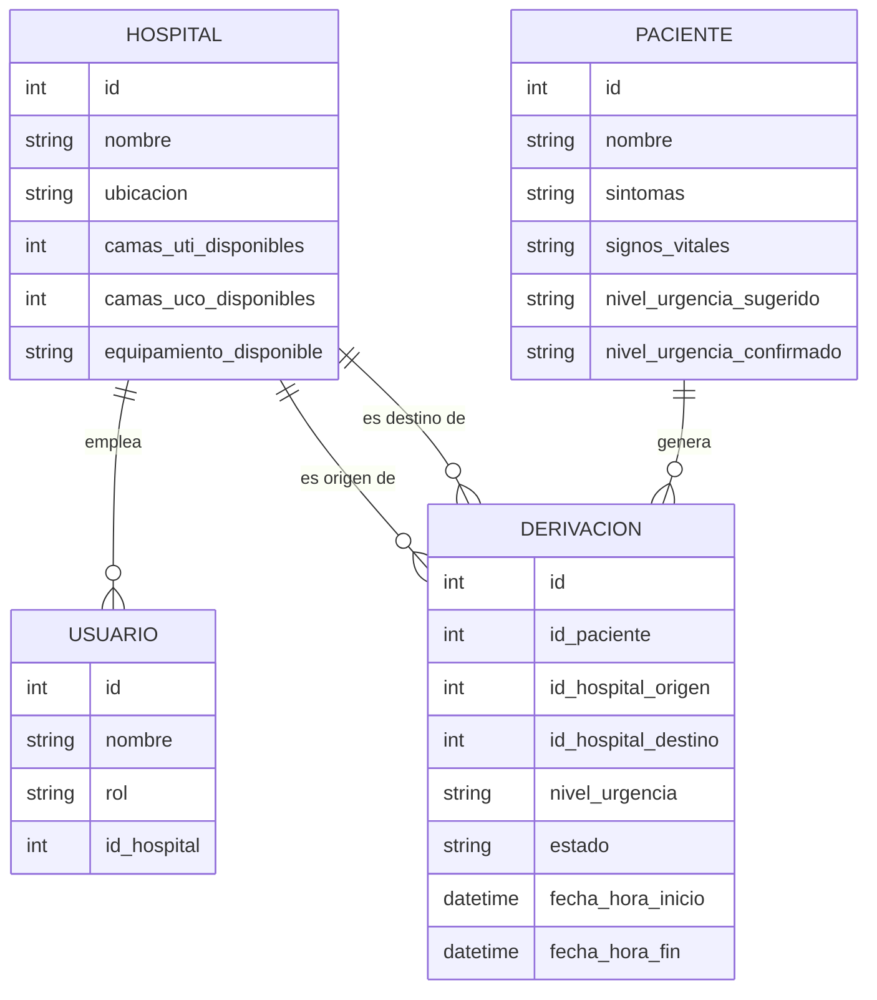

# CareRoute

> Plataforma de coordinación inter-hospitalaria y triaje de traslados críticos.

**Equipo:**

Mateo Dip — responsable del repositorio (creó el repo y tiene la cuenta de Vercel)
Nicolas Censi
Mateo Duran

**Materia:** Metodologías y Desarrollos Web
**URL de producción:** 

---

## 1. Descripción

La derivación de pacientes críticos entre centros de salud y hospitales de cabecera se resuelve
hoy con llamadas telefónicas no centralizadas. Eso produce pérdida de tiempo vital para
localizar camas de terapia (UTI/UCO), falta de visibilidad sobre el equipamiento especializado
disponible y ausencia de trazabilidad del paciente durante el traslado.

**CareRoute** centraliza ese proceso en una sola herramienta web:

- Visibilidad en tiempo real de camas y recursos disponibles por hospital.
- Asignación asistida por un **triaje inteligente** (IA) que sugiere nivel de urgencia y un
  ranking de hospitales candidatos.
- Trazabilidad de la derivación durante todo el traslado.

> **Importante:** la IA es un apoyo a la decisión, no un diagnóstico médico. Toda sugerencia
> debe ser revisada y confirmada por un profesional. El sistema nunca ejecuta una derivación
> de forma automática.

## 2. Equipo y roles

### 2.1 Roles del equipo de desarrollo

| Integrante | GitHub | Rol |
|---|---|---|
| Mateo  Dip | [@`MateoDip`](https://github.com/MateoDip) 
| Mateo Duran | [@`mduranclem`](https://github.com/mduranclem)
| Nicolas Censi | [@`Nicolas-Censi`](https://github.com/Nicolas-Censi)
| Fernando Almansa | [@`Fernando Almansa`](https://github.com/FernandoAlmansa)
### 2.2 Roles de usuario dentro del sistema

| Rol | Qué hace |
|---|---|
| **Médico del centro derivante** | Carga los datos del paciente, recibe la sugerencia de urgencia, revisa el ranking de hospitales y confirma la derivación. |
| **Coordinador del hospital receptor** | Mantiene actualizada la disponibilidad de camas (UTI/UCO) y equipamiento, y recibe la notificación cuando le asignan un traslado. |
| **Personal de traslado** | Actualiza y consulta el estado de la derivación durante el trayecto. |

## 3. Flujo principal

```
1. Login  →  el usuario queda asociado a su hospital / centro de salud

2. Carga del paciente          (HU01)
   síntomas en texto libre + signos vitales + equipamiento requerido

3. Sugerencia de urgencia IA   (HU02)
   nivel sugerido (bajo | medio | alto | crítico) + justificación breve
   el médico acepta o corrige el nivel

4. Ranking de hospitales       (HU03)
   scoring = disponibilidad de cama + distancia + match de equipamiento
   solo hospitales con al menos una cama libre del tipo requerido

5. Confirmación manual         (HU04)
   el médico elige el destino → se crea la Derivación con fecha y hora

6. Notificación al receptor    (HU06)
   el coordinador prepara cama y equipamiento

7. Seguimiento del traslado    (HU07)
   estado: en curso → finalizado, con registro de fecha y hora
```

### Historias de usuario

| ID | Historia |
|---|---|
| HU01 | Crear una derivación con datos del paciente y centro de origen |
| HU02 | Recibir sugerencia de urgencia por IA |
| HU03 | Ver ranking de hospitales recomendados |
| HU04 | Confirmar la derivación |
| HU05 | Actualizar disponibilidad del hospital |
| HU06 | Recibir notificación de traslado asignado |
| HU07 | Seguir el estado de la derivación durante el traslado |

## 4. Modelo de datos



## 5. Stack tecnológico

| Capa | Tecnología |
|---|---|
| Framework | Next.js (App Router) + React |
| Lenguaje | TypeScript (`strict: true`, prohibido `any`) |
| Estilos | Tailwind CSS |
| Validación | Zod (única librería de validación permitida) |
| Base de datos | PostgreSQL en Supabase (región São Paulo · `sa-east-1`) |
| Auth | Supabase Auth |
| IA | API de modelo de lenguaje para interpretar la descripción clínica |
| Deploy | Vercel |
| Control de versiones | GitHub — `main` protegida, cambios vía Pull Request |

## 6. Puesta en marcha local

Requisitos: Node.js 20 o superior y npm.

```bash
git clone https://github.com/MateoDip/CareRoute.git
cd CareRoute
npm install
cp .env.local.example .env.local   # completar con las credenciales de Supabase
npm run dev
```

La app queda en http://localhost:3000

### Variables de entorno

Se cargan en `.env.local`, que **no se commitea** (está en `.gitignore`).

| Variable | De dónde sale |
|---|---|
| `NEXT_PUBLIC_SUPABASE_URL` | Supabase → Project Settings → API |
| `NEXT_PUBLIC_SUPABASE_ANON_KEY` | Supabase → Project Settings → API |
| `SUPABASE_SERVICE_ROLE_KEY` | Supabase → Project Settings → API (solo servidor, nunca en el cliente) |
| `DATABASE_URL` | Supabase → Connect → Transaction pooler (puerto 6543) |
| `DIRECT_URL` | Supabase → Connect → Direct connection (puerto 5432), para migraciones |
| `AI_API_KEY` | Panel del proveedor del modelo de lenguaje |

## 7. Flujo de trabajo con Git

- `main` está protegida: no se aceptan push directos ni force push.
- Todo cambio entra por Pull Request con **al menos una aprobación de otra persona**.
- Nadie aprueba su propio trabajo.
- Nombres de rama: `feat/<descripcion>`, `fix/<descripcion>`, `docs/<descripcion>`.
- Commits en formato Conventional Commits: `feat: ranking de hospitales por scoring`.

Si vas a usar asistentes de IA para escribir código, leé primero [AGENTS.md](./AGENTS.md).

## 8. Requisitos no funcionales

- **RNF01** — la sugerencia de triaje debe responder en pocos segundos (objetivo: < 10 s).
- **RNF02** — interfaz responsive: se usa desde el celular en el momento de la emergencia.
- **RNF03** — los datos del paciente se manejan de forma segura y confidencial.
