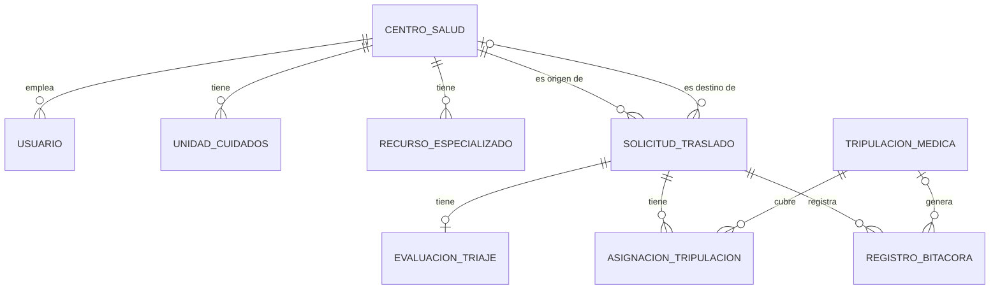

# CareRoute

> Plataforma de coordinación inter-hospitalaria y triaje de traslados críticos.

**Materia:** Metodologías y Desarrollos Web — UAI Rosario
**URL de producción:** https://care-route-beta.vercel.app/

---

## 1. De qué se trata

La derivación de pacientes críticos entre centros de salud se resuelve hoy con llamadas
telefónicas y grupos de WhatsApp. Eso produce pérdida de tiempo vital para encontrar camas
de terapia (UTI/UCO), falta de visibilidad sobre la disponibilidad real y ausencia de
trazabilidad del paciente durante el traslado.

**CareRoute** centraliza ese proceso:

- Disponibilidad de camas por hospital, actualizada por cada centro.
- Un **triaje asistido por IA** que sugiere el nivel de urgencia, y un ranking de hospitales
  con cama del tipo que el paciente necesita.
- Trazabilidad de la derivación de punta a punta.

> **Importante:** la IA es un apoyo a la decisión, no un diagnóstico. Sugiere un nivel de
> urgencia; la derivación la eligen y la confirman médicos. El sistema nunca deriva solo.

## 2. Equipo

| Integrante | GitHub | |
|---|---|---|
| Mateo Dip | [@MateoDip](https://github.com/MateoDip) | **Responsable del repositorio** |
| Mateo Duran | [@mduranclem](https://github.com/mduranclem) | |
| Nicolas Censi | [@Nicolas-Censi](https://github.com/Nicolas-Censi) | |
| Fernando Almansa | [@fernandoalmansa](https://github.com/fernandoalmansa) | |

## 3. Roles del sistema

| Rol | Qué hace |
|---|---|
| **Médico derivante** | Crea la solicitud, registra el triaje (con sugerencia de IA), ve el ranking y elige el hospital de destino. |
| **Médico receptor** | Actualiza las camas de su centro, ve las derivaciones que le propusieron y las aprueba o rechaza. |
| **Admin** | Da de alta, edita y da de baja centros, y asigna rol y centro a cada usuario. No participa del flujo clínico. |

Quien entra por primera vez con Google queda como médico derivante **sin centro**: no puede
operar hasta que un admin le asigne centro (y rol, si corresponde). Nadie se asigna un rol a
sí mismo. La matriz de permisos completa está en [`docs/api.md`](./docs/api.md#matriz-de-permisos).

## 4. Flujo principal

```
1. HU01  El derivante crea la solicitud con el DNI      → PENDIENTE
2. HU02  Carga signos vitales; la IA sugiere urgencia   → EVALUANDO
         (si la IA no responde, elige el nivel a mano)
3. HU03  Ve el ranking de centros con cama del tipo requerido
4. HU04  Elige el destino del ranking
5. HU06  El receptor de ese centro la ve entre sus entrantes
   HU04  y la aprueba: se reserva la cama               → APROBADA
6. HU07  Seguimiento: tripulación asignada y bitácora

Antes de EN_CURSO se puede RECHAZAR; una APROBADA solo la rechaza el receptor.
```

| ID | Historia |
|---|---|
| HU01 | Iniciar una solicitud de derivación |
| HU02 | Recibir la sugerencia de urgencia de la IA |
| HU03 | Ver el ranking de hospitales |
| HU04 | Confirmar la derivación (el derivante elige, el receptor aprueba) |
| HU05 | Actualizar la disponibilidad de camas |
| HU06 | Recibir las derivaciones entrantes |
| HU07 | Seguir el estado del traslado |

Criterios de aceptación, reglas de negocio y requisitos no funcionales: [`docs/spec.md`](./docs/spec.md).

## 5. Modelo de datos

Fuente de verdad: [`prisma/schema.prisma`](./prisma/schema.prisma). Cardinalidades y reglas
de borrado: [`docs/spec.md`](./docs/spec.md) §3.


```mermaid
erDiagram
    CENTRO_SALUD ||--o{ USUARIO : "emplea"
    CENTRO_SALUD ||--o{ UNIDAD_CUIDADOS : "tiene"
    CENTRO_SALUD ||--o{ RECURSO_ESPECIALIZADO : "tiene"
    CENTRO_SALUD ||--o{ SOLICITUD_TRASLADO : "es origen de"
    CENTRO_SALUD |o--o{ SOLICITUD_TRASLADO : "es destino de"
    SOLICITUD_TRASLADO ||--o| EVALUACION_TRIAJE : "tiene"
    SOLICITUD_TRASLADO ||--o{ ASIGNACION_TRIPULACION : "tiene"
    TRIPULACION_MEDICA ||--o{ ASIGNACION_TRIPULACION : "cubre"
    SOLICITUD_TRASLADO ||--o{ REGISTRO_BITACORA : "registra"
    TRIPULACION_MEDICA |o--o{ REGISTRO_BITACORA : "genera"
```

- **N-N:** `SolicitudTraslado` ↔ `TripulacionMedica`, a través de `AsignacionTripulacion`
  (una tripulación hace muchos traslados; un traslado largo puede tener relevo).
- **No hay entidad `Paciente`:** el DNI vive en la solicitud, porque los datos clínicos son
  del episodio, no de la persona.
- **CRUD completo:** `CentroSalud`, a cargo del admin.

## 6. API

Convención: sustantivos en plural; las operaciones del flujo que no son ABM se exponen como
`POST /{recurso}/{id}/{operación}`. Contrato completo, errores y máquina de estados en
[`docs/api.md`](./docs/api.md); pruebas en [`docs/api.http`](./docs/api.http).

| Método y ruta | Qué hace | Rol |
|---|---|---|
| `GET /api/solicitudes` | Solicitudes del centro (`?rol=origen\|destino`, `?estado=`) | Médicos |
| `POST /api/solicitudes` | Crea una solicitud (HU01) | Derivante |
| `GET /api/solicitudes/:id` | Ficha con triaje y tripulación (HU07) | Médicos del centro involucrado |
| `PATCH /api/solicitudes/:id` | Corrige el DNI mientras esté `PENDIENTE` | Derivante del origen |
| `POST /api/solicitudes/:id/evaluacion` | Triaje con sugerencia de IA (HU02) | Derivante del origen |
| `GET /api/solicitudes/:id/candidatos` | Ranking de hospitales (HU03) | Médicos del centro involucrado |
| `POST /api/solicitudes/:id/destino` | Elige el destino (HU04) | Derivante del origen |
| **`POST /api/solicitudes/:id/aprobacion`** | **Aprueba y reserva la cama (HU04)** | **Receptor del destino** |
| `POST /api/solicitudes/:id/rechazo` | Cancela la derivación | Derivante o receptor, según estado |
| `GET /api/solicitudes/:id/bitacora` | Eventos del traslado (HU07) | Médicos del centro involucrado |
| `GET/POST /api/centros`, `GET/PATCH/DELETE /api/centros/:id` | CRUD de centros | Lectura: todos · Escritura: Admin |
| `PATCH /api/unidades/:id` | Actualiza camas (HU05) | Receptor del centro o Admin |
| `GET /api/usuarios`, `PATCH /api/usuarios/:id` | Asigna rol y centro | Admin |

Toda entrada externa se valida con Zod en el servidor. La identidad sale siempre de la
sesión, nunca del body, de un header ni de la query.

## 7. Stack

| Capa | Tecnología |
|---|---|
| Framework | Next.js 16 (App Router) + React 19 |
| Lenguaje | TypeScript 5.7 (`strict: true`, prohibido `any`) |
| Estilos | Tailwind CSS 4 |
| Validación | Zod 3 |
| ORM | Prisma 6 (`prisma.config.ts` en la raíz) |
| Base de datos | PostgreSQL en Supabase (São Paulo · `sa-east-1`), con RLS activado |
| Auth | Supabase Auth con Google |
| IA | OpenAI `gpt-4o-mini` — `lib/servicios/openai.ts` |
| Tests | Vitest |
| Deploy | Vercel |
| CI | GitHub Actions: typecheck, lint y tests en cada Pull Request |

### Estructura

```
app/
  api/                 route handlers (JSON)
  auth/callback/       vuelta del login con Google
lib/
  auth.ts              quién hace el request (sesión, rol, centro)
  errores.ts           responderError: 401 / 403 / 500
  http.ts              respuestas 400 / 404 / 409 / 502
  db/                  consultas Prisma (único lugar que importa Prisma)
  schemas/             schemas de Zod
  servicios/           servicios externos (OpenAI)
  reglas-*.ts, disponibilidad.ts, scoring-hospitales.ts   reglas de negocio puras + tests
prisma/
  schema.prisma        modelo de dominio
  migrations/          migraciones versionadas
  seed.ts              datos de prueba del flujo completo
docs/
  spec.md              requisitos, historias, reglas, integraciones
  api.md               contrato, matriz de permisos, catálogo de errores
  api.http             pruebas con REST Client
  adr/                 decisiones de arquitectura
```

## 8. Cómo levantarlo

Requisitos: Node.js 20 o superior y npm.

```bash
git clone https://github.com/MateoDip/CareRoute.git
cd CareRoute
npm install                 # el postinstall corre prisma generate
cp .env.example .env.local  # y completar (tabla de abajo)
npx prisma migrate deploy   # aplica las migraciones versionadas (una sola persona)
npm run db:seed             # datos de prueba y usuarios de cada rol
npm run dev                 # http://localhost:3000
```

| Script | Qué hace |
|---|---|
| `npm run dev` | Servidor de desarrollo |
| `npm run build` | `prisma generate` + build de producción |
| `npm run lint` | ESLint |
| `npm run typecheck` | `tsc --noEmit` |
| `npm test` | Vitest |
| `npm run db:seed` | Carga el seed (idempotente: reinicia los datos de prueba) |

### Variables de entorno

No se commitean (`.gitignore`). Los valores se pasan por mensaje privado, nunca por el repo,
un issue ni un PR. Las de servidor también se cargan en Vercel → Settings → Environment
Variables.

| Variable | De dónde sale |
|---|---|
| `NEXT_PUBLIC_SUPABASE_URL` | Supabase → Project Settings → API |
| `NEXT_PUBLIC_SUPABASE_ANON_KEY` | Supabase → Project Settings → API (pública por diseño; RLS cierra la API REST) |
| `DATABASE_URL` | Supabase → Connect → ORM → Transaction pooler (puerto 6543, `?pgbouncer=true`) |
| `DIRECT_URL` | Supabase → Connect → Direct connection (puerto 5432), para migraciones |
| `OPENAI_API_KEY` | platform.openai.com → API keys. Solo servidor, nunca `NEXT_PUBLIC_` |
| `OPENAI_BASE_URL` | Opcional. Solo para probar el timeout (ver `docs/api.http`, clase 7) |
| `SEED_EMAIL_ADMIN`, `SEED_EMAIL_DERIVANTE`, `SEED_EMAIL_RECEPTOR` | Solo local. Cuentas de Google reales a las que el seed les da cada rol, para poder entrar como ese rol |

## 9. Flujo de trabajo con Git

- `main` está protegida: no se aceptan push directos ni force push.
- Todo cambio entra por Pull Request con **al menos una aprobación de otra persona**.
- La regla activa es *require approval of the most recent reviewable push*: quien pushea
  último no puede aprobar ese PR.
- El CI tiene que pasar en verde antes de mergear.
- Si tocás dependencias, `package.json` y `package-lock.json` van en el mismo commit.
- Ramas: `feat/…`, `fix/…`, `docs/…`. Commits en formato Conventional Commits.
- Migraciones: las genera y aplica **una sola persona**; el resto hace `git pull` y
  `npx prisma generate`. Una migración aplicada no se edita nunca.

Si vas a usar asistentes de IA para escribir código, leé primero [AGENTS.md](./AGENTS.md).

## 10. Requisitos no funcionales

- **RNF01** — la sugerencia de triaje responde en menos de 10 s (timeout de 8 s a OpenAI).
- **RNF02** — interfaz responsive: se usa desde el celular en la emergencia.
- **RNF03** — datos del paciente confidenciales: cada usuario solo accede a las derivaciones
  de su centro (autorización en `lib/db/`), a OpenAI solo viajan signos vitales, y la API
  REST de Supabase está cerrada con RLS (ADR 0007).
